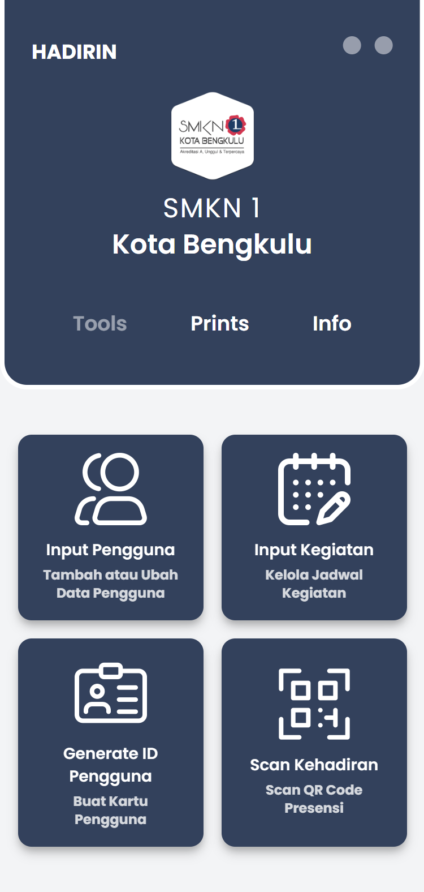
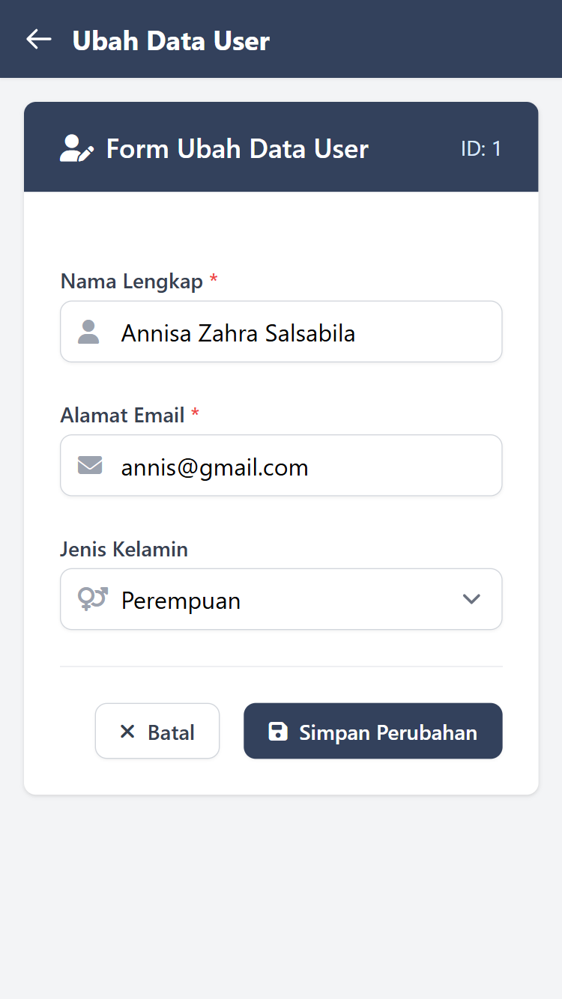
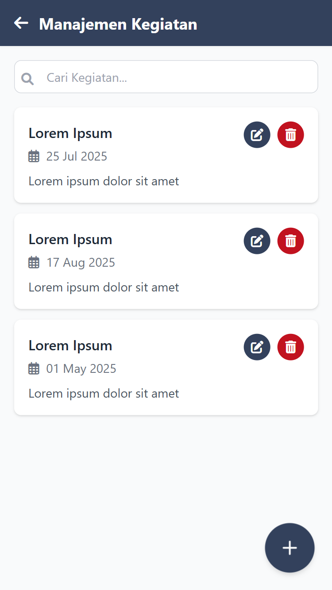
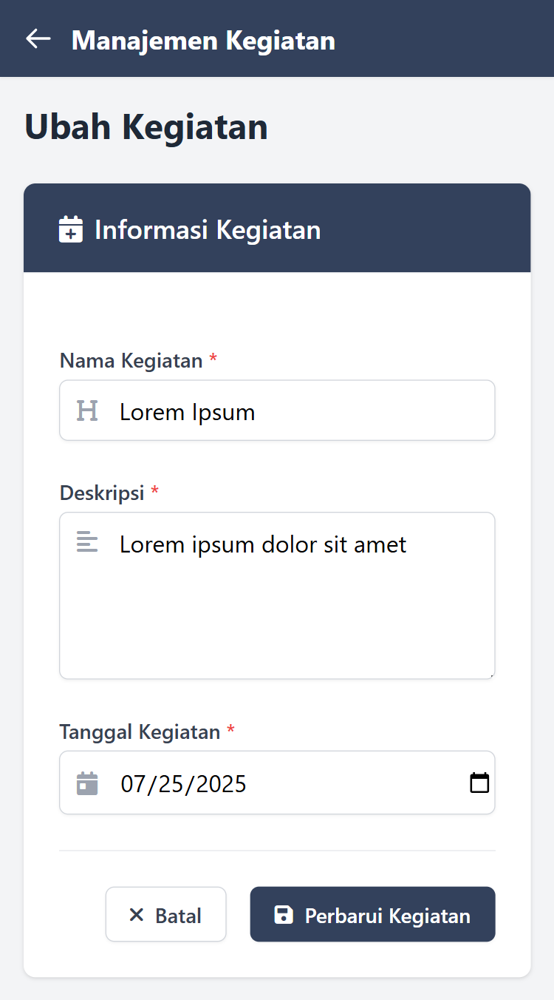
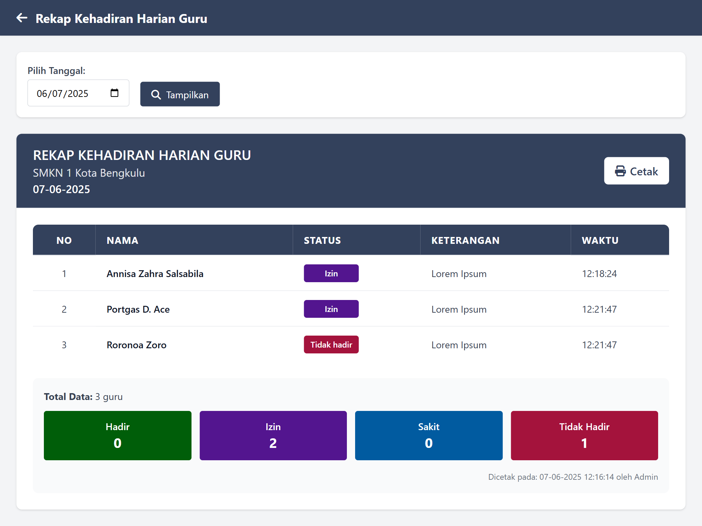
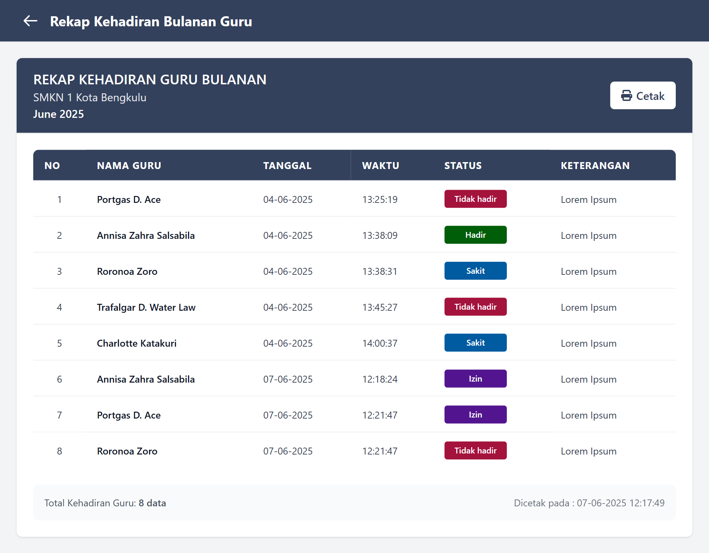

# Hadirin - Sistem Kehadiran SMKN 1 Kota Bengkulu

Sebuah sistem berbasis web yang dirancang untuk mempermudah pencatatan dan pengelolaan kehadiran para Guru di SMKN 1 Kota Bengkulu.
Aplikasi ini dikembangkan menggunakan teknologi PHP dan MySQL, dengan antarmuka pengguna yang sederhana agar mudah dioperasikan oleh admin.

---

## Fitur-fitur Utama

- Menyediakan ringkasan kehadiran harian maupun bulanan yang dapat dicetak
- Menyediakan jadwal kegiatan yang diadakan sekolah
- Absensi dilakukan melalui pemindaian QR Code
- Desain antarmuka responsif dan ramah pengguna

---

## Tampilan website Hadirin

## 🛠️ Tab Tools

### Halaman Dashboard 


### Halaman Manajemen Pengguna


### Halaman Tambah Pengguna


### Halaman Edit Pengguna


### Halaman Manajemen Kegiatan


### Halaman Tambah Kegiatan


### Halaman Edit Kegiatan


### Halaman Generate ID Pengguna


### QR Code User


### Halaman Scan QR Code


---

## 🖨️ Tab Prints

### Halaman Dashboard 


### Halaman Cetak Kehadiran Harian


### Halaman Cetak Kehadiran Bulanan


### Halaman Cetak ID Semua Pengguna


---

## ℹ️ Tab Info

### Halaman Dashboard 


---

## Teknologi yang Digunakan

- HTML, Tailwind CSS, JavaScript (Frontend)
- PHP (Backend)
- MySQL (database)
- XAMPP sebagai localhost server

---

## Setup Guide

### Clone Project
```bash
git clone https://github.com/szannisa/Hadirin.git
cd hadirin
```
### 2. Copy file .env.example
```bash
copy .env.example .env
```
### 3. Setup database pada komputer anda, lalu masukkan kredensial-kredensialnya ke file .env.
```bash
DB_CONNECTION=mysql
DB_HOST=127.0.0.1
DB_PORT=3306
DB_DATABASE=db-hadirin
DB_USERNAME=root
DB_PASSWORD=
```

### 4. Install dependency
```bash
composer install
```

### 5. Generate application key
```bash
php artisan key:generate
```
### 6. Link storage untuk file upload
```bash
php artisan storage:link
```
### 7. Migrasi database
```bash
php artisan migrate
```
### 8. Jalankan aplikasi
```bash
php artisan serve
```

---

## Dikembangkan Oleh
Annisa Zahra Salsabila | 2025
GitHub: szannisa 😎
